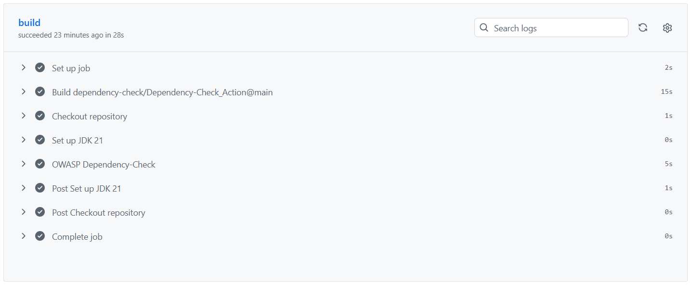
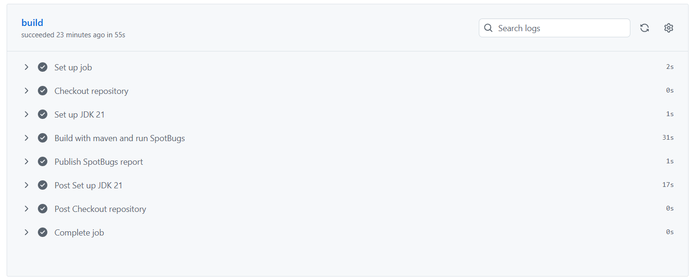

# ИТМО. 2026. 4 курс. ИБ. Лабораторная работа №1
Выполнил: `Марухленко Иван Сергеевич`
Группа: `P3433`

## Описание проекта и API
+ ***Язык программирования/Фреймворк***: Java/Spring Boot
+ ***Менеджер пакетов***: maven

+ сборка проекта: ```mvn install```
+ запуск: ```java -jar target/is-1-1.0.jar```
+ для работы приложения требуется работающий экземпляр PostgreSQL на `5432` порте. Можно использовать Docker Container: ```docker run --name postgres-is -e POSTGRES_PASSWORD=password -d postgres```

Проект предназначен для доступа к коллекции записей, состоящих из полей title и magicNumber, со стороны множества пользователей. Предусмотрена возможность добавления новых записей в коллекцию. Доступ к коллекции возможен только после прохождения аутентификации.

### API
`/auth/login POST` - аутентификация пользователя по username и password, получает данные в формате *UserDTO*, в случае успеха возвращает объект с JWT-токеном

`/auth/registration POST` - регистрация пользователя по username и password, получает данные в формате *UserDTO*, в случае успеха возвращает объект с JWT-токеном

`/api/data GET` - получение данных из коллекции, возвращает список объектов в формате *DataDTO*. Успех если пользователь авторизован, из данных будут выбраны только созданные пользователем.

`/api/data PUT` - добавляет в коллекцию новые данные, возвращает ответ с кодом 201 Created в случае успеха, принимает данные в формате *DataDTO*. Успех если пользователь авторизован.

## Описание реализованных мер защиты
+ ***SQLi***: используется *JPA*, взаимодействие с БД происходит через фреймворк Hibernate, SQL запросы заменяются вызовом функций соответствующих JPA репозиториев.
+ ***XSS***: реализован *XssFilter*, оборачивающий запросы в *XssRequestWrapper*, в котором методы обращения к параметрам и заголовкам дополняются исключением из их содержимого вредоносного HTML кода (с помощью метода Jsoup.clean библиотеки Jsoup с политикой Safelist.relaxed с разрешенными тегами `a`, `b`, `blockquote`, `br`, `caption`, `cite`, `code`, `col`, `colgroup`, `dd`, `div`, `dl`, `dt`, `em`, `h1`, `h2`, `h3`, `h4`, `h5`, `h6`, `i`, `img`, `li`, `ol`, `p`, `pre`, `q`, `small`, `span`, `strike`, `strong`, `sub`, `sup`, `table`, `tbody`, `td`, `tfoot`, `th`, `thead`, `tr`, `u`, `ul`)
+ ***Broken Authentication***: реализована выдача JWT-токена после успешного входа в аккаунт. За управление токенами отвечает JwtService, используемый сервисом для аутентификации AuthenticationService. Для всех запросов на все пути (кроме `/auth/**`) реализована проверка JWT-токена на валидность через JwtAuthenticationFilter и настрйку Spring Security.

## SAST/CSA
Скришноты SAST/CSA и ссылки на последний запуск Pipeline:

https://github.com/march-bear/is-1/actions/runs/20998889685/job/60363084506



https://github.com/march-bear/is-1/actions/runs/20998889638/job/60363084564

